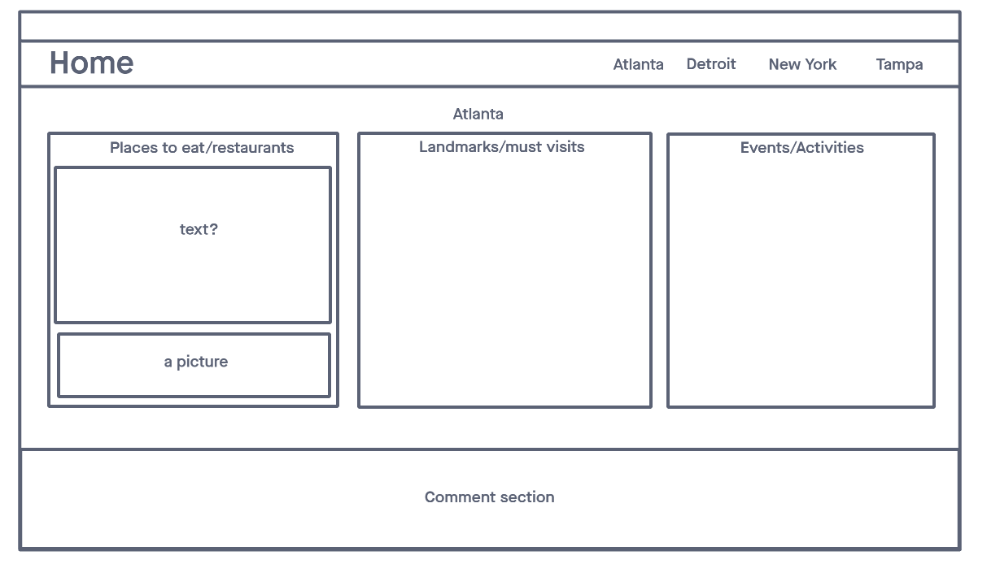
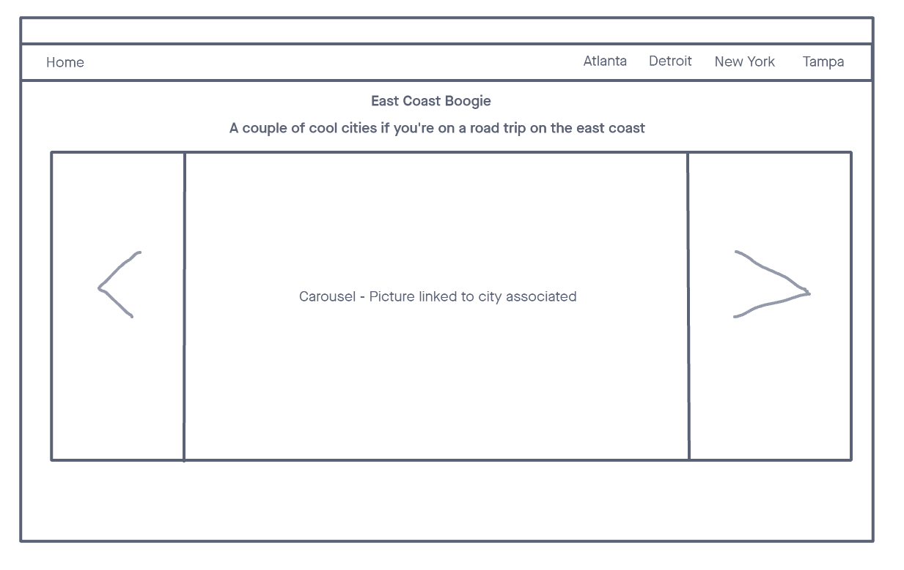
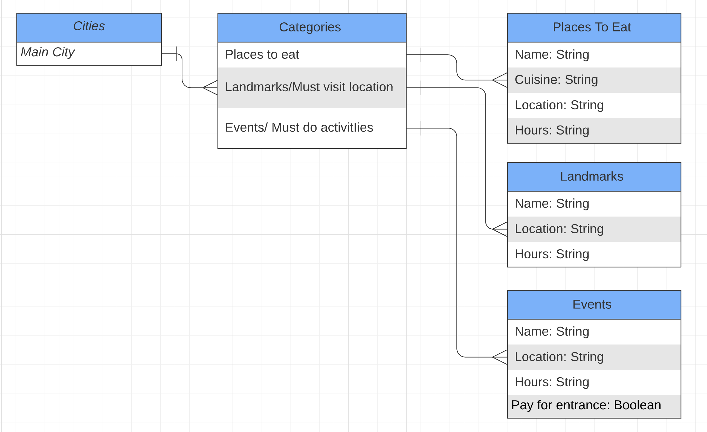
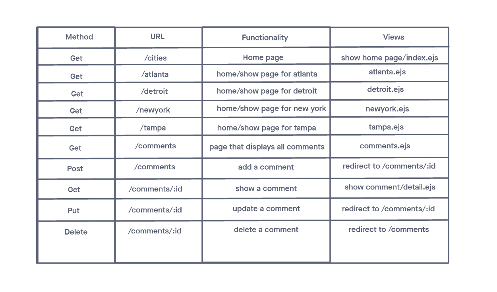

# East-Coast-Boogie
A couple cool cities if you're on a road trip on the east coast! Users have the ability to view great experiences by categories of:
1) Places to eat
2) Landmarks/must visit locations
3) Events/activities to enjoy

This is a full-stack Node app, using mainly EJS. The app can be found [here!](https://east-coast-boogie.herokuapp.com/)

### Technologies Used
CSS, Bootstrap, Javascript, EJS, Express, Node.js, Mongoose, MongoDB, and Heroku

### Low-Fidelity Wireframes

## East Coast Boogie Overview
## Project Description
Since the app is deployed on heroku & we have a seed file for our app, One major step is needed for the app to run properly. You must first do 'node dbtest.js' in the heroku console. This is how our MongoDB will receive the necessary data for our application.
### User Stories
As a user, I will arrive at the East Coast Boogie home page. On the home page I will see a nav bar with four cities that are clickable, bringing me to each city’s homepage. I will also see a carousel of images representing each city. I will also be able to click on each photo bringing me to that city’s page.
 
Within each city’s homepage I will see a list of categories such as places to eat, landmarks and must visits, and events/activities. I will also see a comment section where users can interact with each other and comment on things they have done within that city. When I click on each category, it will bring me to that show page. Within that page will be a list of recommendations based on that category. 
### MVP Goals
1)	Render a home page with light css styling
2)	Have a One to One link set-up for one city item 
3)	Have a city page with light css styling 
### Stretch Goals
1) Have multiple cities
2) Have a link for each item, that's displayed under each category, so that takes you to a page that shows an in-depth  description of the activity.
3) Turn our one main comment section to a city-based for each unique city
4) Incoporate mobile-responsive UI / styling
5) Incorporate third-party API
6) render group name in read me 
### Database ERD Diagrams

### RESTful Routing Chart 

